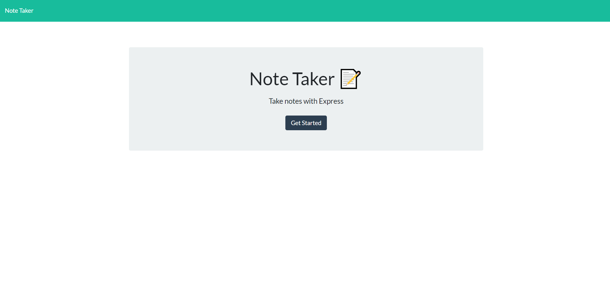

# Note Taker!

## Description
A program that lets users saves notes to a server using heroku. The user can create a new note with a title and with a text, they can save the note and return to it at another time to view it.
        
## Table of Contents
- [Installation](#installation)

- [Usage](#usage)

- [License](#license)

- [Video](#video)

- [Test](#test)

- [Contributors](#contributors)

- [Questions](#questions)

    
## Installation
No packages have to be installed, but if cloned through git repository, npm inquirer, express and path is needed to run the application locally.

## Usage
To create a new note, press the "Get Started" button, the user is then directed to a new page where they can create a new note. Type the title of the note and the text, then click the save icon on the top right to create and save the note. The newly created note will appear on the left column with the title, click on the note to view its content. Click on the pencil icon on the top right to create a new note. To delete a saved note click on the trash can icon.
        
## License
This project uses MIT

## Video

## Test
N/A

## Contributors
Jae Kim

## Questions
View my other projects!

https://github.com/JSK321

Have any questions?

Email me at: jaeshinkim321@gmail.com